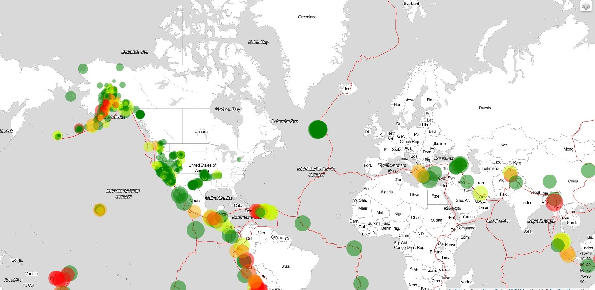

### Visualizing Data with Leaflet
The United States Geological Survey, or USGS for short, is responsible for providing scientific data about natural hazards, the health of our ecosystems and environment, and the impacts of climate and land-use change. Their scientists develop new methods and tools to supply timely, relevant, and useful information about the Earth and its processes. As a new hire, you will be helping them out with an exciting new project!
The USGS is interested in building a new set of tools that will allow them to visualize their earthquake data. They collect a massive amount of data from all over the world each day, but they lack a meaningful way of displaying it. Their hope is that being able to visualize their data will allow them to better educate the public and other government organizations (and hopefully secure more funding) on issues facing our planet.

## Visualization

Created the earthquake Visualization using Leaflet, creates a map that plots all the earthquakes from  dataset based on their longitude and latitude.

Data markers reflected the magnitude of the earthquake by their size and the depth of the earthquake by color. Earthquakes with higher magnitudes appear larger, and earthquakes with greater depth appear darker in color.

Included popups that provide additional information about the earthquake when its associated marker is clicked

Created a legend to provide context for the map data

## Data Source
https://earthquake.usgs.gov/earthquakes/feed/v1.0/geojson.php

https://github.com/fraxen/tectonicplates

